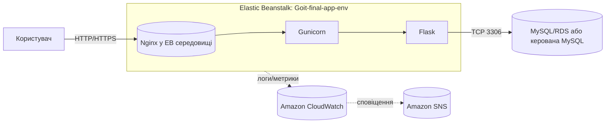

# Фінальний проєкт — Звіт  
**ПІБ:** Андрій Машталер  
**Проєкт:** Деплой Flask вебзастосунку в AWS Elastic Beanstalk  

---

## 1. Опис середовища
- **Сервіс розгортання:** AWS **Elastic Beanstalk** (Web Server, Python 3.9 на Amazon Linux 2023 / AL2023)
- **Застосунок / середовище:** `goit-final-app / Goit-final-app-env`
- **Домен середовища:** `http://goit-final-app-env.eba-zpc83hcm.eu-central-1.elasticbeanstalk.com`
- **Оркестрація процесів:** `Nginx` → `Gunicorn` → `Flask`
- **Сховище даних:** MySQL (SQLAlchemy + PyMySQL) — підключення через env variables
- **Моніторинг/логи:** Amazon **CloudWatch** (доступні access/error Nginx, web stdout; Health event streaming увімкнено, retention 7 днів)
- **Мережева безпека:** VPC + Security Groups (HTTP 80/tcp зовні; доступ до БД лише з SG застосунку)
- **IAM:** роль інстансу EB для CloudWatch / (за потреби) доступу до S3/Secrets Manager

---

## 2. Обґрунтування вибору технологій
- **Elastic Beanstalk** — швидкий керований деплой без ручного опрацювання EC2/ALB/Nginx; автоматичні оновлення й health.
- **Gunicorn + Nginx** — перевірений продакшн-стек для WSGI, стабільність та продуктивність.
- **Flask** — легкий фреймворк для навчального CRUD/демо.
- **SQLAlchemy** — абстракція над БД, зручні міграції/сідінг, пул з’єднань.
- **CloudWatch** — єдиний стандарт логів і моніторингу в AWS, інтегрується з SNS для алертів.
- **VPC + SG** — ізоляція рівнів та мінімально необхідні доступи (principle of least privilege).

---

## 3. Архітектурна схема рішення

> Поточна конфігурація — single instance EB (Nginx проксить на `127.0.0.1:8000` до Gunicorn). Для вимоги "балансування + авто‑масштабування" наведено кроки нижче (переведення на ALB + Auto Scaling).

---

## 4. Інструкція з деплою та налаштувань

### 4.1. Підготовка застосунку
1. **Структура пакунку (zip для EB):**
   - `app.py` (або модуль із Flask `app`)
   - `requirements.txt` (Flask, Gunicorn, SQLAlchemy, PyMySQL, boto3 (за потреби) тощо)
   - `Procfile` — команда запуску:
     ```
     web: gunicorn --bind 127.0.0.1:8000 app:app
     ```
   - каталоги `templates/`, `static/` (якщо використовуються)
   - (опційно) `.ebextensions/` і `.platform/` для тюнінгу

2. **Environment variables** (EB → Configuration → Software):
   - `DB_HOST`, `DB_USER`, `DB_PASS`, `DB_NAME`
   - `FLASK_ENV=production` (за потреби)
   - `HEALTHCHECK_PATH=/health` (якщо використовуєте в своїй логіці)

3. **Health endpoint** у Flask:
   ```python
   @app.get("/health")
   def health():
       return {"status": "ok"}, 200
   ```

### 4.2. Створення та деплой у Elastic Beanstalk
1. **Elastic Beanstalk → Applications → Create application**  
   Application name: `goit-final-app` → **Create environment** (Web server, Python 3.9 AL2023).
2. Завантажити ZIP архів → **Upload and deploy**.
3. Після деплою перевірити URL:  
   `http://goit-final-app-env.eba-zpc83hcm.eu-central-1.elasticbeanstalk.com`
4. У **Configuration → Software** вказати `Health check path = /health` і **Save**.
5. Перевірити, що **Health = Ok**.

### 4.3. Моніторинг і логування (CloudWatch + SNS)
1. **Health event streaming**: EB → Configuration → Monitoring → *Enable* (Retention: 7 днів).
2. **CloudWatch Log groups**: переконатися, що з’явилися групи логів EB/Nginx.
3. **SNS-Topic** для алертів (наприклад, `alerts-goit-final`) → підписати e‑mail.
4. **CloudWatch Alarms** (зв’язати з SNS Topic):
   - `HTTP 5XX > 0` (по ALB/TargetGroup, якщо буде LB; або власні метрики).
   - `Latency p95 > 800ms` (по ALB, якщо ввімкнено LB).
   - Для БД (якщо RDS): `CPUUtilization > 80%`, `FreeStorageSpace < 15%`.

### 4.4. Автомасштабування та балансування навантаження (переведення на ALB)
> Якщо середовище створене як **Single instance**, змініть ємність на **Load balanced**:
1. EB → **Configuration → Capacity** → **Edit**:  
   - **Environment type**: *Load balanced*  
   - **Autoscaling group**: **Min = 2**, **Max = 4**  
   - **Instance type**: t4g.small / t3.small (під бюджет)  
2. **Rolling updates & deployments**: Enable (immutable або rolling з health check).
3. **Load balancer**:
   - Тип: **Application Load Balancer (ALB)**
   - **Health check path**: `/health`
   - Listener: 80 (і 443 з ACM‑сертифікатом — за потреби HTTPS)
4. **Scaling policies** (простий приклад):
   - Scale **out**: коли `CPUUtilization >= 60%` за 5 хв → +1 інстанс
   - Scale **in**: коли `CPUUtilization <= 30%` за 10 хв → −1 інстанс
5. Security Groups: відкрити 80/443 зовні до ALB; трафік ALB → інстанси по 80.

### 4.5. Перевірки після зміни ємності
- **ALB Target Health** = healthy
- `/` і `/health` повертають 200 зі стабільною затримкою
- При навантаженні додаються інстанси, після спаду — видаляються

### 4.6. Smoke & Load тест
```bash
# Smoke
curl -I http://goit-final-app-env.eba-zpc83hcm.eu-central-1.elasticbeanstalk.com/health

# Навантаження (приклад з ApacheBench)
ab -n 1000 -c 50 http://goit-final-app-env.eba-zpc83hcm.eu-central-1.elasticbeanstalk.com/
```
(За бажанням використати `hey`: `hey -z 1m -c 50 <URL>`)

---

## 5. Скриншоти / відео-докази
> Додайте ці файли до пакету або вставте посилання на відео:
1. **Розгортання середовища**: сторінка Environment зі статусом **Health = Ok**.  
   _Файл:_ `01-eb-env-ok.png`
2. **Моніторинг у CloudWatch**: Log groups (access/error), health streaming, приклад подій/метрик.  
   _Файл:_ `02-cloudwatch-logs.png`
3. **Автомасштабування та балансування**: Capacity=Load balanced, ASG min/max, ALB listeners, Target health.  
   _Файл:_ `03-asg-alb-config.png`
4. **Алерти**: CloudWatch Alarms, SNS‑підписка (email підтверджено).  
   _Файл:_ `04-alarms-sns.png`
5. **Навантажувальне тестування**: скрін CLI з результатами p95/p99.  
   _Файл:_ `05-loadtest.png`

(За бажанням додати коротке **відео** з переходами по консолі AWS).

---

## 6. Керування витратами
- **AWS Budgets**: створено бюджет із порогами (напр., 10€ / 20€) та e‑mail‑сповіщеннями.
- **Cost Explorer**: увімкнено **cost allocation tags** (`Project=GoIT-Final`, `Env=Prod`) для фільтрації витрат.
- Операційні поради: для дев-середовища — single instance; для прод — ALB+ASG з невеликим інстансом і агресивнішими scale‑in порогами.

---

## 7. Мапа на вимоги
- ✅ Вибір середовища: **Elastic Beanstalk**
- ✅ VPC/SG/IAM: налаштовано мінімально необхідні доступи
- ✅ База даних: MySQL (SQLAlchemy + PyMySQL), змінні середовища
- ✅ Моніторинг: CloudWatch логи + health streaming, рекомендовані алерти
- ✅ Оптимізація вартості: Budgets + Cost Explorer
- ✅ Деплой: Upload & Deploy ZIP, `Procfile`, `requirements.txt`
- ✅ Балансування/Авто‑масштабування: кроки виконання додані (перехід на ALB + ASG)

---

## 8. Корисні посилання (для перевірки)
- **Продуктивний URL**:  
  `http://goit-final-app-env.eba-zpc83hcm.eu-central-1.elasticbeanstalk.com`
- **CloudWatch Log group (health)**:  
  `aws/elasticbeanstalk/Goit-final-app-env/environment-health.log`

---

**Готово до перевірки.**  
У разі потреби надам додаткові логи/скрінкасти.
